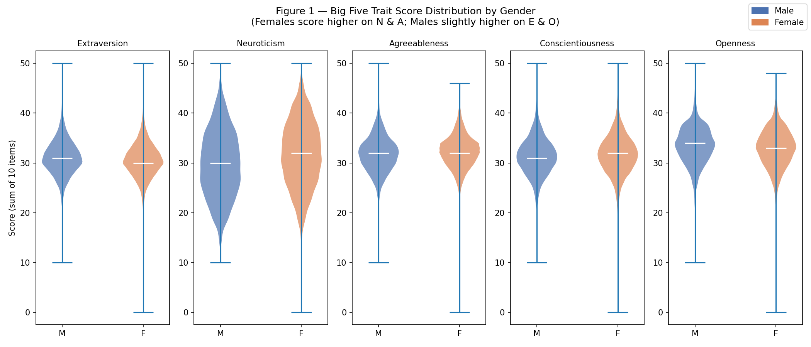

# Big Five Mini Explorer

A lightweight Python data analysis project that cleans, visualises, and interprets Big Five (OCEAN) personality survey data from Open Psychometrics.
以 Python 分析 Big Five 人格特質是否因性別與年齡而系統性地變動


---

## Live Demo

[https://Jie-Yi-Lu.github.io/big5-mini-explorer/](https://Jie-Yi-Lu.github.io/big5-mini-explorer/)

---

## Screenshot



*Figure 1 — Violin plot of Big Five trait scores by gender (n ≈ 19,608 after cleaning). Females score notably higher on Neuroticism and Agreeableness; males slightly higher on Extraversion and Openness.*

---

## Motivation

大五人格（Big Five）是人格心理學領域當前被廣泛應用的人格理論框架之一，包括以下五種人格特質維度（簡稱 OCEAN 取自這五種特質的專有名詞之字首）：

(1) 開放性（Openness）
對新經驗、創意與想像力的接納程度。得分越高，表示個人的好奇心越強、越有冒險精神或越有創新性；得分越低，表示個人越趨於傳統保守或實務。

(2) 盡責性（Conscientiousness）
目標導向、自律與組織能力。得分越高，表示處事方面越趨於負責、謹慎、有條理；得分越低，表示處事方面越趨於衝動、隨興。

(3) 外向性（Extraversion）
社交刺激的偏好與能量來源。得分越高，表示個人越趨於活潑、外放；得分越低，表示個人越趨於內向、獨立。

(4) 親和性（Agreeableness）
與人合作、信任與同理的傾向。得分越高，表示處人方面越趨於友善、易同理、願意與他人合作；得分越低，表示處人方面越趨於懷疑、中心。

(5) 神經質（Neuroticism）
面對壓力與情緒起伏的程度。得分越高，表示個人越容易憂慮、情緒波動越大；得分越低，表示個人越趨於冷靜沉穩而自信。

關注 Big Five（外向性、神經質、親和性、盡責性、開放性）是否因性別與年齡而系統性地變動。本專案以 Open Psychometrics 的大型公開問卷資料（n = 19,719）為基礎，試圖回答兩個問題：
（1）五個人格特質的分數分布在男女之間是否存在可觀察的差異？
（2）外向性分數是否隨年齡呈現有意義的趨勢？

---

## How to run

```bash
# 1. Clone the repo
git clone https://github.com/Jei-Yi-Lu/big5-mini-explorer.git
cd big5-mini-explorer

# 2. Create and activate virtual environment
python -m venv .venv

# Windows
.venv\Scripts\activate
# macOS / Linux
source .venv/bin/activate

# 3. Install dependencies
pip install -r requirements.txt

# 4. Download raw data (git-ignored; must be done manually)
#    Source: https://openpsychometrics.org/_rawdata/BIG5.zip
#    Target: data/raw/BIG5/data.csv

# macOS / Linux
curl -L https://openpsychometrics.org/_rawdata/BIG5.zip -o BIG5.zip && \
  unzip BIG5.zip -d data/raw/ && \
  rm BIG5.zip

# Windows PowerShell
Invoke-WebRequest https://openpsychometrics.org/_rawdata/BIG5.zip -OutFile BIG5.zip
Expand-Archive BIG5.zip -DestinationPath data\raw\
Remove-Item BIG5.zip

# 5. Run the notebook
jupyter notebook notebooks/01_explore.ipynb
```

Running all cells produces:

| File | Description |
|---|---|
| `reports/fig1_violin_gender.png` | Violin plot — Big Five scores by gender |
| `reports/fig2_extraversion_age.png` | Extraversion trend across age groups |

---

## Project structure

```
big5-mini-explorer/
├── data/
│   ├── raw/BIG5/data.csv     ← download manually (git-ignored)
│   └── processed/            ← cleaned outputs (git-ignored)
├── notebooks/
│   ├── 01_explore.ipynb      ← main analysis: cleaning + 2 figures
│   ├── style_a_oneliner.ipynb
│   ├── style_b_specification.ipynb
│   └── style_c_planfirst.ipynb
├── src/
│   ├── load_data.py          ← load_clean_data() with defensive checks
│   ├── clean_data.py         ← clean() stub
│   └── mini_analysis_pipeline.py
├── reports/                  ← generated PNG figures (committed)
│   ├── fig1_violin_gender.png
│   └── fig2_extraversion_age.png
├── docs/                     ← GitHub Pages static site
├── requirements.txt
├── .gitignore
└── README.md
```

---

## Prompt Style Comparison

| Style | 產出能直接跑嗎？ | 程式碼可讀性 | 防呆程度（處理 edge case） | 你下次會選哪個？為什麼？ |
|---|---|---|---|---|
| A. One-liner | 可以 | 中 | 無 | X |
| B. Specification | 可以 | 中 | 僅過濾無效的 age 和 紀錄丟棄的資料筆數 | X |
| C. Plan-first | 可以 | 高 | 比起 Style B，C 考慮的最周全，甚至還會請 AI 協處提出可能有所疏漏之處，並且在執行計畫前還會先用文字和使用者完整確認一遍，這樣最不易出錯 | 我會選 C，不如說我本來的使用習慣就如 Style C，主要是想避免 AI 在執行過程中針對我疏忽之處加油添醋，且我希望是在有意識下得到 AI 產出精確結果 |

---

## Data source & License

**Dataset**: Big Five Personality Test  
**Provider**: Open-Source Psychometrics Project  
**URL**: [https://openpsychometrics.org/_rawdata/](https://openpsychometrics.org/_rawdata/)  
**Direct download**: `https://openpsychometrics.org/_rawdata/BIG5.zip`  
**Format**: Tab-separated, 57 columns — demographic fields (race, age, gender, hand, engnat, source, country) + 50 Likert items (E1–E10, N1–N10, A1–A10, C1–C10, O1–O10)  
**License**: The dataset is made freely available by the Open-Source Psychometrics Project for research and educational purposes. Please cite accordingly:

> Open-Source Psychometrics Project. (n.d.). *Big Five Personality Test*. Retrieved from https://openpsychometrics.org/_rawdata/

Raw data is **not committed** to this repository (see `.gitignore`). Follow the download steps above to obtain it.

---

## Author

**呂杰驛（Jie-Yi Lu）**
國立中央大學　認知神經科學研究所　碩二生（National Central University, Graduate Institute of Cognitive Neuroscience, Second-year graduate student）
id: 113825002
